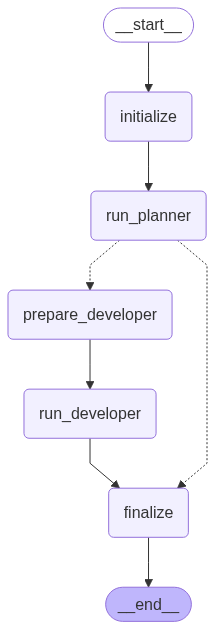
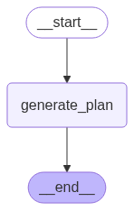
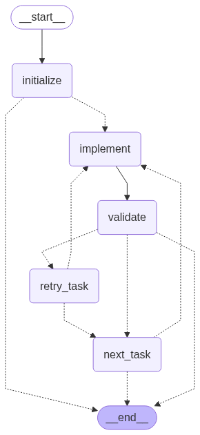

# AgentCode: An Agentic IDE

This project, `agentcode`, implements a sophisticated, multi-agent AI system designed to automate software development tasks. It uses a graph-based workflow (powered by LangGraph) to orchestrate a "Planner" agent and a "Developer" agent, taking a high-level user request and turning it into functional code.



## ✨ Features

* **Autonomous Task Planning**: A Planner agent analyzes the user's request and breaks it down into a series of smaller, actionable "atomic tasks".
* **Code Generation & Modification**: A Developer agent executes each task, capable of creating new files, modifying existing ones, and iteratively working through the plan.
* **Graph-Based Orchestration**: Leverages LangGraph to create resilient and inspectable workflows. The state is explicitly managed, allowing for complex logic like retries, conditional branching, and easy debugging.
* **Modular Agent Design**: The Planner and Developer are independent sub-graphs, making them easy to test, maintain, and upgrade.
* **Configuration Driven**: Easily configure models, API keys, and workflow parameters through a central `config.py` file and `.env` variables.
* **Workspace Management**: All file operations are contained within a dedicated workspace directory for safety and organization.
* **Graph Visualization**: Includes a script to automatically generate and save visual diagrams of the workflows, providing a clear view of the agent's "thought process".

## 🚀 Getting Started

Follow these steps to get the project running on your local machine.

### 1. Prerequisites

* Python 3.10+
* Git

### 2. Installation

1. **Clone the repository:**

```bash
git clone https://github.com/shoryasethia/agentcode.git
cd agentcode
```

2. **Create and activate a virtual environment:**

```bash
python -m venv .venv
source .venv/bin/activate  # On Windows, use `.venv\Scripts\activate`
```

3. **Install the required dependencies:**

```bash
pip install -r requirements.txt
```

4. **Configure Environment Variables:**

Copy the example environment file:

```bash
cp .env.example .env
```

Now, open the `.env` file and add your API keys:

```
# .env
GOOGLE_API_KEY=AIza...
TAVILY_API_KEY=tvly-...
```

## 🧪 Usage

There are three main ways to interact with the project.

### 1. Command-Line Interface (CLI)

The `main.py` script is the primary entry point for running the full development workflow.

**Syntax:**

```bash
python main.py "<your development task>" [optional/path/to/workspace]
```

**Example:**

```bash
python main.py "create a python file that prints hello world" ./hello-world-proj
```

### 2. Interactive Examples

The `usage_example.py` script provides a user-friendly menu to run pre-defined tasks.

```bash
python usage_example.py
```

## 🛠️ How It Works: Architecture and Logic

The system is built on the concept of a `StateGraph` from LangGraph, where nodes are functions that modify a shared state object, and edges define the flow of control.

### Overall Orchestration

The main workflow in `main.py` acts as the master conductor. It doesn't perform development tasks itself but instead delegates work to the specialized agents (sub-graphs).

1. `initialize`: Sets up the session, creating initial state objects for the planner and developer.
2. `run_planner`: Invokes the entire Planner agent sub-graph.
3. **Conditional Edge**: After the planner runs, this edge checks if the planner produced any tasks.

   * If **yes**, it proceeds to `prepare_developer`.
   * If **no**, it skips development and goes directly to `finalize`.
4. `prepare_developer`: Prepares the input for the Developer agent by passing the list of atomic tasks.
5. `run_developer`: Invokes the entire Developer agent sub-graph.
6. `finalize`: Compiles the results from the developer's work into a final summary.

### The Planner Agent

The Planner's job is to transform a high-level user goal into a concrete, machine-readable plan. It is a self-contained graph that ensures a valid plan is always produced.



**Logic:**

1. `initialize`: Prepares the state for planning.
2. `generate_plan`: Calls the LLM with a specialized prompt, asking it to return a JSON array of tasks.
3. `validate_plan`: Attempts to parse the LLM's response. It checks if the output is valid JSON and conforms to the expected structure.
4. **Conditional Edge**: Based on the success of `validate_plan`:

   * If the plan is **valid**, it proceeds to `finalize`.
   * If the plan is **invalid** (e.g., malformed JSON), it branches to `create_fallback_plan`.
5. `create_fallback_plan`: If the LLM fails, this node creates a single, simple task as a safety net to ensure the developer has at least one thing to work on.
6. `finalize`: A terminal node that consolidates the final plan before returning control to the main orchestrator.

### The Developer Agent

The Developer is the workhorse of the system. It executes the plan created by the Planner, one task at a time, in a robust loop.



**Logic:**

1. `initialize`: Takes the list of tasks and sets up the execution loop, starting with the first task.
2. `implement`: The core action node. It reads the current task's description and type (e.g., `create_file`), calls the LLM to generate the necessary code or content, and writes it to the file system.
3. `validate`: A simple check to see if the implementation step completed without errors.
4. **Conditional Edge**: Based on the validation result:

   * On **success**, it moves to `next_task`.
   * On **failure**, it moves to `retry_task`.
5. `retry_task`: Manages the retry loop. If the maximum number of retries has not been reached, it increments the retry counter and routes back to `implement`. If retries are exhausted, it gives up on the current task and routes to `next_task` to avoid getting stuck.
6. `next_task`: Moves the pointer to the next task in the list and routes back to `implement`. If there are no more tasks, it exits the loop by transitioning to the `END` state.

## 🧠 State Management

The workflow's memory and data are managed through `TypedDict` state objects defined in `state.py`.

* **`OverallState`**: The global container that holds everything. It contains the other two states (`planner_state`, `developer_state`) and global information like the user's task and session ID.
* **`PlannerState`**: Contains only the information relevant to the Planner agent, such as the user task, the raw LLM response, and the final list of `atomic_tasks`. This isolation prevents the Planner from accessing irrelevant developer information.
* **`DeveloperState`**: Holds the state for the development loop, including the full list of tasks, the `current_task` being worked on, files created/modified, and retry counts.